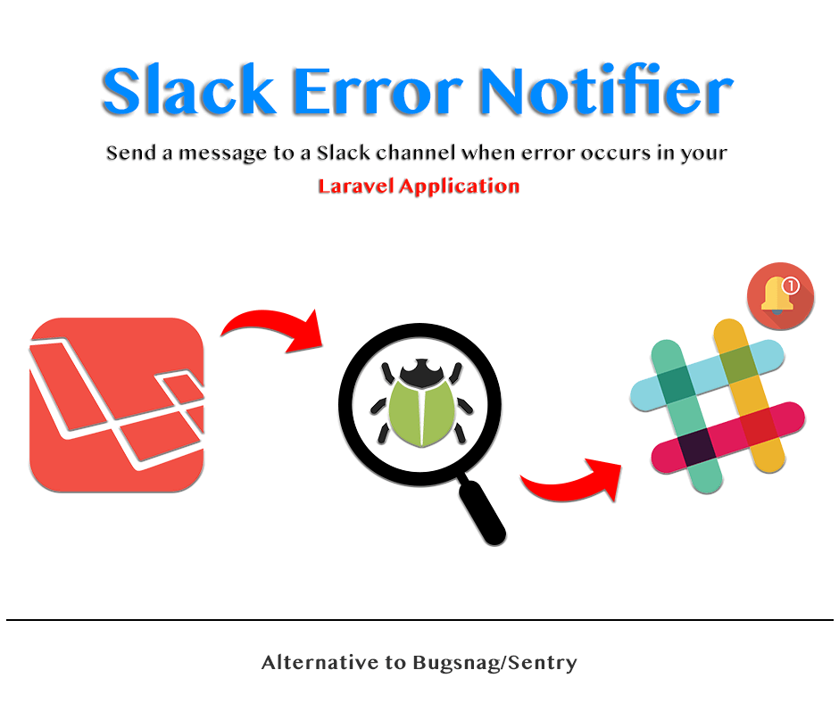
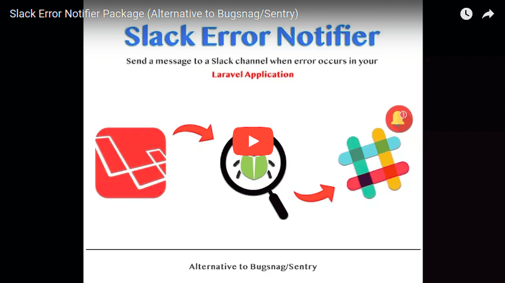

# Slack Error Notifier (Alternative to *Bugsnag/Sentry*) (Laravel 5.5)
If you can't use *Bugsnag* or *Sentry* for monitoring your **production Laravel application**, here is a really simple solution to get notified when anything goes wrong.

This is a *plug-and-play* Laravel package to send a message to a Slack channel via an [Incoming WebHook](https://api.slack.com/incoming-webhooks) when error/exception occurs in your application.


**Note**: Logging feature had major updates in Laravel 5.6. you may use [Laravel Log Enhancer](https://github.com/freshbitsweb/laravel-log-enhancer) package for it.


## Requirements

* PHP 7.0+
* Laravel 5.5

## Installation

1) Install the package by running this command in your terminal/cmd:
```
composer require freshbitsweb/slack-error-notifier
```

2) Import config file by running this command in your terminal/cmd:
```
php artisan vendor:publish --tag=slack-error-notifier-config
```

3) Create an [Incoming WebHook](https://my.slack.com/services/new/incoming-webhook/) in your Slack account and put *Webhook URL* in your .env file for **SLACK_WEBHOOK_URL** variable
```
SLACK_WEBHOOK_URL=https://hooks.slack.com/services/XXXXXXXXX/XXXXXXXXX/xxxxxxxxxxxxxxxxxxxxxxxx
```

4) Optinal: Change configuration settings:
* (bool) add_memory_usage => Set to *true* if you wish to send memory usage in the slack message

* (bool) add_request_headers => Set to *true* if you wish to send request headers in the slack message

* (bool) add_session_data => Set to *true* if you wish to send session data in the slack message

* (bool) add_input_data => Set to *true* if you wish to send input data in the slack message

* (array) ignore_request_fields => If input data is being sent, you can specify the inputs from the user that should not be sent to Slack for example, password,cc number, etc.

* (env) SLACK_LOG_LEVEL => Specify minimum error level (#1) to notify slack.

And it's done. Yeah, that simple. Here's a video demo for a quick look:

[](https://www.youtube.com/watch?v=jeljU856bzE)

#### Note
This package uses *Monolog* library and sends a notification message based on the [**log_level**](https://laravel.com/docs/5.5/errors#log-severity-levels) configuration setting. So, if you set it to *alert*, only alert and emergency level errors will be considered.

## Authors

* [**Gaurav Makhecha**](https://github.com/gauravmak) - *Initial work*

See also the list of [contributors](https://github.com/freshbitsweb/slack-error-notifier/graphs/contributors) who participated in this project.

## License

This project is licensed under the MIT License - see the [LICENSE](LICENSE) file for details

## Special Thanks to

* Laravel Community
